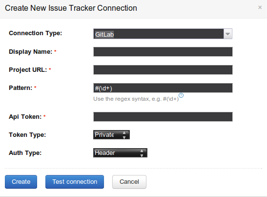
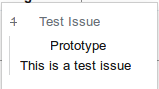

# TeamCity GitLab Issues

## Description

TeamCity GitLab Issues is a TeamCity plugin used 
to connect to an GitLab installation via API 
and retrieve information about tickets stored in
GitLabs internal issue tracker.

## Usage

After installing the plugin navigate to 
Project Settings > Issue Trackers to create, edit or 
delete an issue tracker.

In the issue tracker popup choose 'GitLab' as Connection
type and configure the connection:
- Display Name
    - An arbitrary name for the connection
- Project URL
    - The URL to your GitLab project
- Pattern
    - A pattern with which to identify issues
    This must contain a capture for integers
    like `(\d+)` for the issue number
- Api Token
    - Your API Token
- Token Type
    - Which kind of token is used (see [here](http://docs.gitlab.com/ce/api/README.html#authentication))
- Auth Type
    - How to send login information, either as
    URL parameter or in request header

When the connection is properly configured TeamCity
will parse commit messages of any builds changes
for the given pattern an link it to the issue
in your GitLab installation.

Furthermore a popup will appear when you 
hover of the issue link containing its ID, title,
description and milestone.

